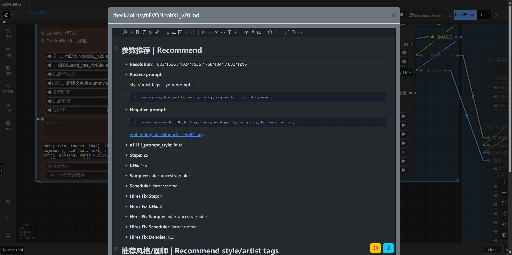

# ComfyUI-MDNotes

该自定义节点可根据checkpoints名称自动寻找对应的markdown笔记文件并呈现给用户；用户在编辑器中完成修改后，可回存至硬盘中。

## 概述

ComfyUI-MDNotes在Comfy Core、Easy Use的CheckpointLoader等节点上注册了Show model note右键菜单。点击该菜单即会弹出如下对话框，用户可随意读取/修改笔记文件。滚动至页面底端后，点击Ok保存修改；点击Cancel、点击对话框周围区域或按Esc键取消修改。


## 技术栈

- **[Vue.js](https://vuejs.org/)** - 超棒的前端框架
- Vditor - 所见即所得的markdown编辑器
- Bootstrap - 超棒的

## 安装

⚠️ **Important** ⚠️

This demonstration node is not designed to be installed directly via **git clone**. For proper functionality, please install through:

- [ComfyUI Manager]()
- [ComfyUI Registry]()

## 开发配置步骤

If you want to learn how to develop this custom node or modify it, you can set up a local development environment. Follow these steps:

1. Clone the repository in your ComfyUI custom nodes directory:
   ```bash
   git clone https://atomgit.com/qq_39710999/comfyui-mdnotes
   ```
2. Navigate to the project directory:
   ```bash
   cd ComfyUI_frontend_vue_basic
   ```
3. Install dependencies:
   ```bash
    npm install
   ```
4. Build the project:
   ```bash
   npm run build
   ```
5. Refresh ComfyUI to load.

## 开发日志

ComfyUI关于自定义节点开发的文档质量一言难尽，官方文档内容不全，网络上的教程质量亦参差不齐，故将笔者开发该节点的过程分享于此，有需自取即可，欢迎指正与PR。

### 准备模板

笔者选择使用Vue来开发前端，因此借用了自定义节点的Vue模板。该模板可通过如下命令获得：

```bash
comfy node scaffold
```

在回答一系列问题后即可获得模板（注意在它询问使用什么模板时选择Yes, use Vue...那一项）。

接下来使用VS Code打开模板。此时Code会给.py文件里的大量内容标红线表示找不到，此时做两件事情：

1. 将解释器设置成ComfyUI所使用的那个Python解释器。
2. 在 `.vscode/settings.json` 中，设置 `"python.analysis.extraPaths"`和 `"python.autoComplete.extraPaths"`为ComfyUI的根目录，即`server.py`, `nodes.py`等文件所在的那个目录

此时.py文件中的红线会消失大半，.ts, .vue文件中的红线可能还有，这个就得碰运气了，有时候Code连`import {...} from 'vue'`也会标红线，此时建议重新运行`npm i`然后重启Code，有可能就好了。计算机，很神奇吧~

至于前端文件中把 `../../../scripts/app.js` 等内容标红，目前尚无解决办法。

### 编写前端

编写前端的办法基本上和普通的Vue项目没差，但最终装载 Vue 组件的TS代码有差异，本仓库的这部分代码有如下注意点：

```typescript
// -- snip --

// 这行是一定会被标红的，没办法
import { app } from "../../../scripts/app.js";
// 用它给 app.js 标注类型的话，可以利用自动补全写代码，很爽
import type { ComfyApp } from '@comfyorg/comfyui-frontend-types'
const comfyApp: ComfyApp = app;

// 想要加载CSS吗？那就引入它吧
import * as utils from '../../../scripts/utils.js';
// extensions是固定的
// comfyui-mdnotes是自定义节点的目录名字
// 后续内容和/js目录有关，而js目录结构取决于vite.config.mts
utils.addStylesheet("extensions/comfyui-mdnotes/assets/main.css");

// -- snip --
comfyApp.registerExtension({
  name: "endericedragon.mdnotes",
  // 装载一定要在页面元素都齐活之后再做
  async setup() {
    // 使用TS生成挂载点
    let mountPoint = document.createElement("div");
    mountPoint.id = "mdnotes-ui";
    document.body.appendChild(mountPoint);
    // 然后把Vue组件挂载到挂载点上即可
    createApp(App).use(createBootstrap()).mount(mountPoint);
  }
});
```

此外，为了实现灵活的信息传递，本项目大量使用事件监听器实现跨组件通信，如下：

```typescript
window.addEventListener("event-id", e => {
  let detail = (e as CustomEvent).detail;
  // detail的结构与发送事件时保持一致
  detail["content"]...
  detail["filename"]...
})

window.dispatchEvent(
  new CustomEvent("event-id", { 
    detail: { 
      content: "hello", filename: "test.md" 
    } 
  })
)
```

### 编写后端

本仓库的后端全部写在 `__init__.py` 中，具体编写方法较为简单，自行查阅即可~